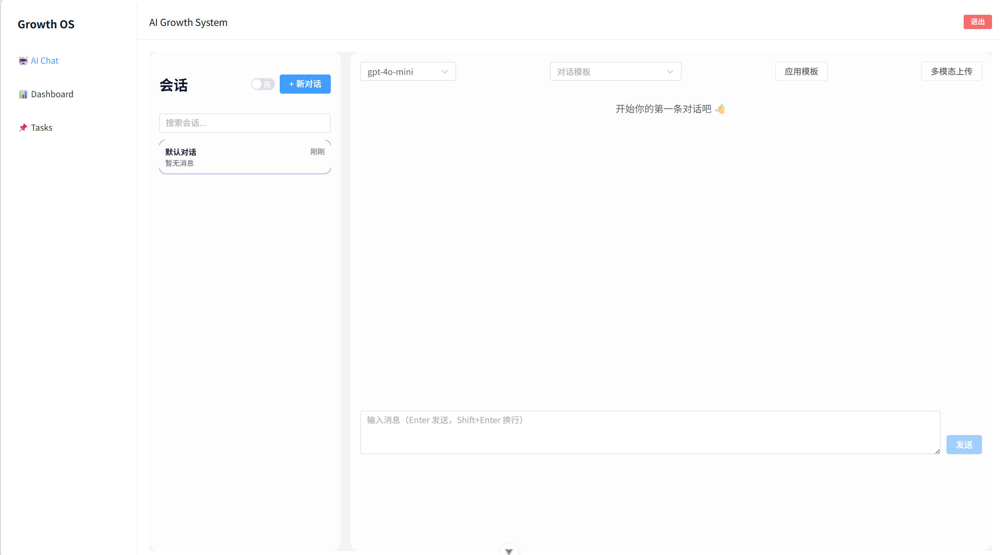
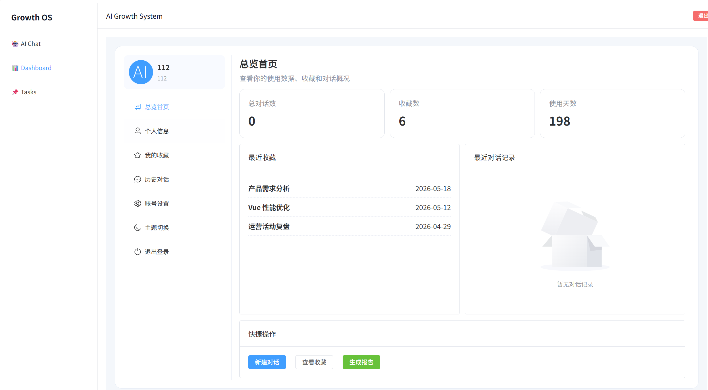
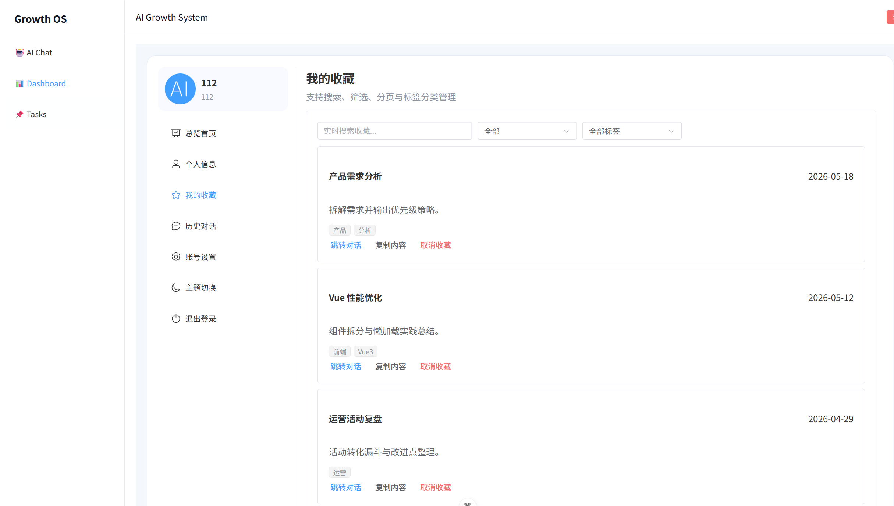
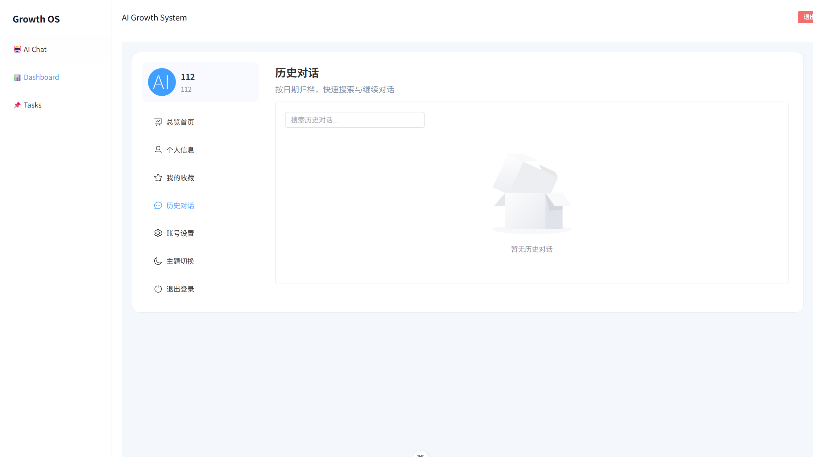
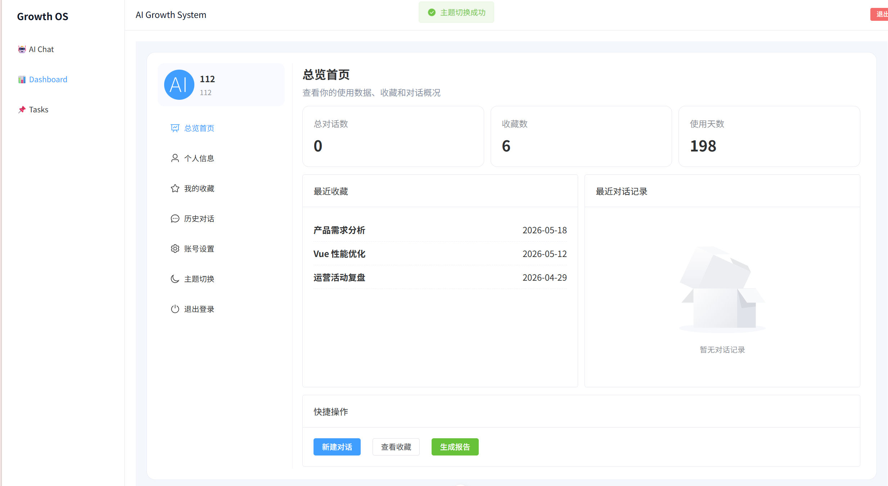

# Growth OS - AI 对话与个人成长中枢

基于 Vue3 + Spring Boot 开发的全栈项目，支持账号体系、AI 对话、个人收藏与任务管理。

---

## 📸 项目截图展示

### 功能界面 1

### 功能界面 2

### 功能界面 3

### 功能界面 4

### 功能界面 5

---

## 项目介绍
- 前端：Vue3 + Vite + Element Plus
- 后端：Spring Boot + MyBatis-Plus + MySQL
- 核心功能：AI 对话、对话收藏、用户中心、任务管理

## 快速开始
### 前端
npm install
npm run dev

### 后端
配置数据库后启动 Spring Boot 项目
